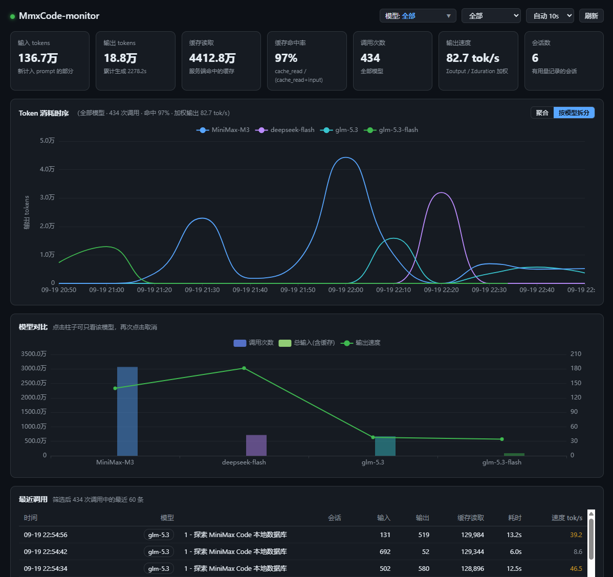

# mcode-monitor

> 官方 Mini App 仓库已收录，可前往官方社区下载正式版：[MiniMax-AI/MiniMax-Code-MiniApps](https://github.com/MiniMax-AI/MiniMax-Code-MiniApps)。本仓库是开发主版本，有更新会同步提交到官方。

MiniMax Code 本地用量监控面板（Mini App 版）。装进 MiniMax Code 后随时打开，看 token 消耗、输出速度、缓存命中率和各模型的用量分布。

  

只读读取本地数据库，不影响正在使用的 MiniMax Code，无需安装任何依赖包。

## 功能

- KPI 总览：token 消耗、输入 / 输出 / 缓存读取、缓存命中率、调用次数、输出速度
- Token 消耗时序：按时间跨度自动分桶，缓存 + 输入堆叠柱与输出曲线
- 模型筛选：多选下拉，实时作用于全部图表与表格
- 按模型拆分：一键切换为各模型的输出曲线
- 模型对比：输入总量柱状图 + 调用次数 / 输出速度双曲线
- 最近调用明细：时间、模型、会话、tokens、耗时、速度
- 亮 / 暗双主题，跟随系统
- 时间范围：最近 1 小时 / 24 小时 / 7 天 / 30 天 / 全部
- 自动刷新：5s / 10s / 30s / 手动

## 安装

本机需要 Python 3.8+（无需 pip 安装任何包）。

把仓库里的 `miniapps/mcode-usage-monitor` 文件夹放进 `~/.minimax/plugins/` 目录：

| 系统 | 目标位置 |
| --- | --- |
| Windows | `C:\Users\<用户名>\.minimax\plugins\mcode-usage-monitor` |
| macOS / Linux | `~/.minimax/plugins/mcode-usage-monitor` |

然后从 MiniMax Code 的 Mini App 入口打开「Token 用量看板」即可。

关闭页面不影响使用，随时从同一入口再次打开；想卸载，删掉上面那个文件夹就行。

## 指标说明

| 指标 | 含义 |
| --- | --- |
| Token 消耗 | 输入 + 缓存读取 + 输出 |
| 缓存命中率 | prompt 里直接命中缓存的比例，越高越省 |
| 输出速度 | 输出 tokens ÷ 耗时的加权平均 |

计费与额度以 MiniMax Code 产品内的用量页展示为准。

## 关于 AI 生成

本项目的代码与文档由 **MiniMax Code**（AI 编程助手）生成并迭代，作者负责需求定义、方向决策与验收。仓库内的提交同样包含大量 AI 协作产出，这一点在此如实说明。

## 参考项目

- [zcode-monitor](https://github.com/yiyanwannian/zcode-monitor) — 本项目的思路来源，早先的 ZCode 用量监控面板

## 第三方组件

- [ECharts](https://echarts.apache.org/) — Apache License 2.0，已本地化打包以便离线使用

## License

[MIT](LICENSE)
