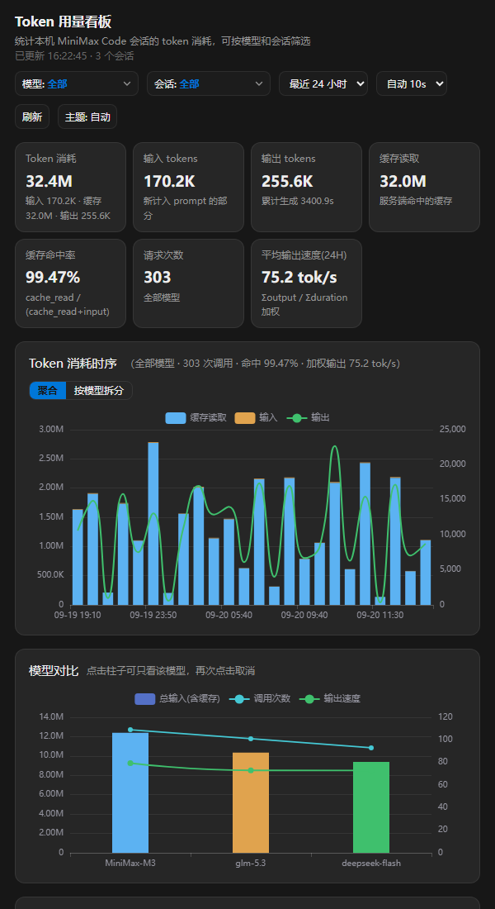

# Token 用量看板

[English](README.md) | 简体中文

近实时查看本机 MiniMax Code 的 Token 用量：消耗趋势、输出速度、缓存命中率、模型对比和最近请求，可按时间范围、模型和会话筛选。

作者：[yanhy2000](https://github.com/yanhy2000) · 版本：`1.1.0`



*预览中的会话与用量均为合成数据。应用界面目前为中文。*

## 安装与使用

将本目录完整复制到 MiniMax Code 当前数据目录下的 `plugins/` 中。`<dataDir>` 默认为用户主目录下的 `.minimax`，因此默认安装路径为：

```text
<dataDir>/plugins/mcode-usage-monitor/
```

保留 `.minimax-plugin` 隐藏目录。重新启动支持 MiniApp 的 MiniMax Code，确认插件已被识别并启用，然后打开「Token 用量看板」，或在对话中请求打开它。

页面默认显示最近 24 小时，可切换 1 小时 / 24 小时 / 7 天 / 30 天 / 全部，并可按模型和会话多选筛选。筛选条件、时间范围、刷新间隔和主题会被记住。页面默认每 10 秒自动刷新（可切换 5 秒 / 10 秒 / 30 秒或手动刷新）。

本插件需要本机已安装 **Python 3.8+** 用于读取本地数据库；只用标准库，无需 `pip install`。不需要 API Key 或其他配置。

## 数据与统计口径

数据来自两处本地来源：

- `<dataDir>/v2/sqlite/runtime-state.sqlite`：通过 SQLite 官方 backup API 建立只读内存快照，不锁库，不影响正在运行的客户端。
- `<dataDir>/v2/sessions`：扫描真实会话文件（`messages.jsonl`）用于生成会话列表。

统计规则：

- Token 消耗 = 输入 + 缓存读取 + 输出；缓存命中率 = 缓存读取 /（缓存读取 + 输入）
- 按 `msg_id` 跨会话去重：会话重建时历史消息会被复制进新会话，同一批调用只计一次

本工具是本地近实时观测，计费与额度以产品内「用量」页为准；产品内数字来自服务端统计，存在延迟（实测约一天内补齐），也可能有自己的口径。

运行时不向外部服务发送任何数据，无遥测；只向 Host 提供的插件数据目录写入一个偏好文件（`prefs.json`）。页面会显示真实会话标题，分享截图时请注意。

## 源码与验证

页面位于 `miniapp/client/index.html`（ECharts 已本地化打包），Node 入口位于 `miniapp/node/server.mjs`，数据后端位于 `miniapp/node/api.py`，无需构建。

已验证环境：MiniMax Code 桌面端 `3.0.73.166`，Windows（10.0.26200，x64）。开发过程中已验证：插件安装与打开、数据聚合与去重、模型/会话筛选、偏好记忆、自动刷新、主题切换、图表与列表渲染。macOS 与 Linux 未验证。

第三方组件：[ECharts](https://echarts.apache.org/)（Apache License 2.0），已本地化打包以便离线使用。

## 许可证

[MIT](LICENSE)。
